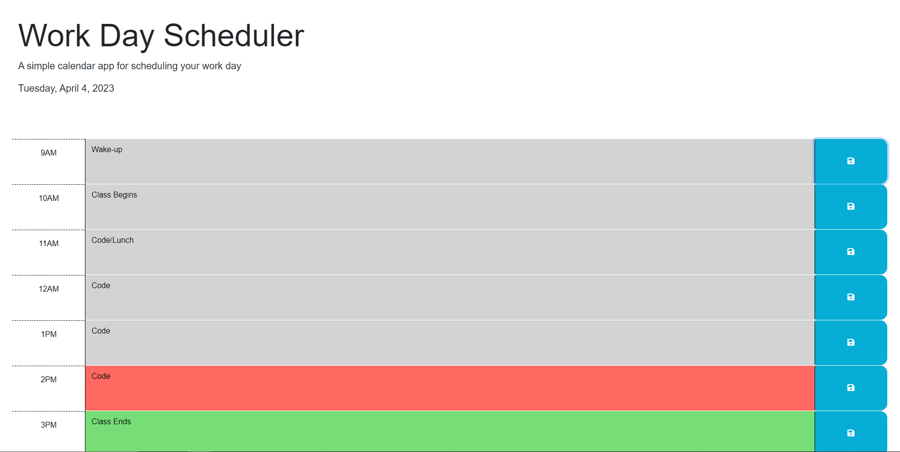

# JQuery-Scheduler

## Description

This is an example of how JQuery can be used for DOM traversal, as well as modifying classes. This project also uses day.js to acquire current time and date with the ability to save messages in local storage, which are displayed in the time blocks according to the user. The project can be seen here: https://codemonkeyspoon.github.io/JQuery-Scheduler/

## Preview

